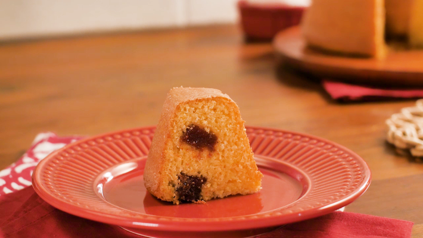

<h1 align="center"> Réplica - Tudo Gostoso </h1>

📝 - Réplica de uma página de receita do site Tudo Gostoso, realizada a fim de praticar desenvolvimento Web.

💻️ - Foi utilzado HTML e CSS no projeto. 

🖱️ - Acesse a página clicando <a href="https://oruzinho.github.io/replicaTudoGostoso/">aqui</a>

